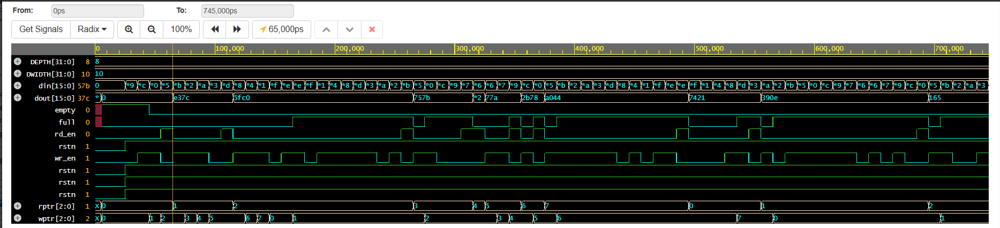

# Synchronous FIFO Verification using UVM

## Project Overview

This project implements verification of a parameterized **Synchronous
FIFO** using **SystemVerilog and UVM methodology**.

The verification environment validates: 
- Write operations
- Read operations
- Full condition handling
- Empty condition handling
- FIFO data ordering integrity

------------------------------------------------------------------------

## DUT Description

The design is a single-clock synchronous FIFO with:

-   DATA_WIDTH = 16
-   DEPTH = 8
-   Active-low reset
-   Full and Empty flag generation

### Interface Signals

  | Signal  | Description       |
  | --------| ------------------|
  |  clk    |  System clock     |
  |  rstn   |  Active-low reset |
  |  wr_en  |  Write enable     |
  |  rd_en  |  Read enable      |
  |  din    |  Data input       |
  |  dout   |  Data output      | 
  |  full   |  FIFO full flag   |
  |  empty  |  FIFO empty flag  |

------------------------------------------------------------------------

## UVM Testbench Architecture

test\
└── env\
├── agent\
│ ├── sequencer\
│ ├── driver\
│ └── monitor\
└── scoreboard

------------------------------------------------------------------------

## Key Components

### Sequence Item

-   Randomized write/read enables
-   Weighted distribution (70% write, 30% read)
-   Prevents simultaneous read and write

### Sequence

-   Randomizes number of transactions (50--100)
-   Generates constrained random stimulus

### Driver

-   Drives signals on positive clock edge
-   Uses UVM handshake mechanism

### Monitor

-   Samples interface at clock edge
-   Handles read latency correctly
-   Sends transactions to scoreboard

### Scoreboard

-   Implements reference FIFO using SystemVerilog queue
-   Push on write
-   Pop on read
-   Compares expected vs actual data
-   Reports mismatches using UVM error

------------------------------------------------------------------------

## Verification Strategy

The environment verifies: 
- Sequential writes
- Sequential reads
- FIFO full boundary condition
- FIFO empty boundary condition
- Random transaction ordering
- Data integrity

------------------------------------------------------------------------

## Waveform

Below is a waveform snippet captured during simulation, showing clocked read/write transactions:

**Signals shown:**  
`clk`, `rstn`, `wr_en`, `rd_en`, `din`, `dout`, `empty`, `full`

------------------------------------------------------------------------

## ▶️ How to Run (EDA Playground)
1. Go to [EDA Playground](https://edaplayground.com)
2. Select:
   - **Language:** SystemVerilog
   - **Libraries:** UVM → UVM 1.2
3. Place your files:
   - `design.sv` → **Design panel**
   - `testbench.sv` → **Testbench panel**
4. Enable **Use UVM**
5. Run the simulation

> Waveforms are dumped using `$dumpfile` / `$dumpvars`.

------------------------------------------------------------------------

## Technologies Used

-   SystemVerilog
-   UVM
-   Constrained Random Verification
-   Queue-based Reference Modeling

------------------------------------------------------------------------

## Author

Yeswanthi Gandham\
IP Design Verification Engineer\

